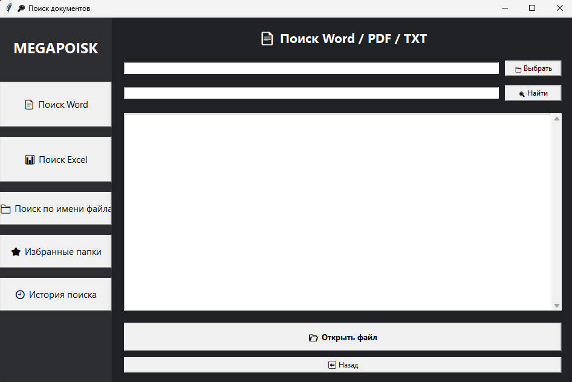
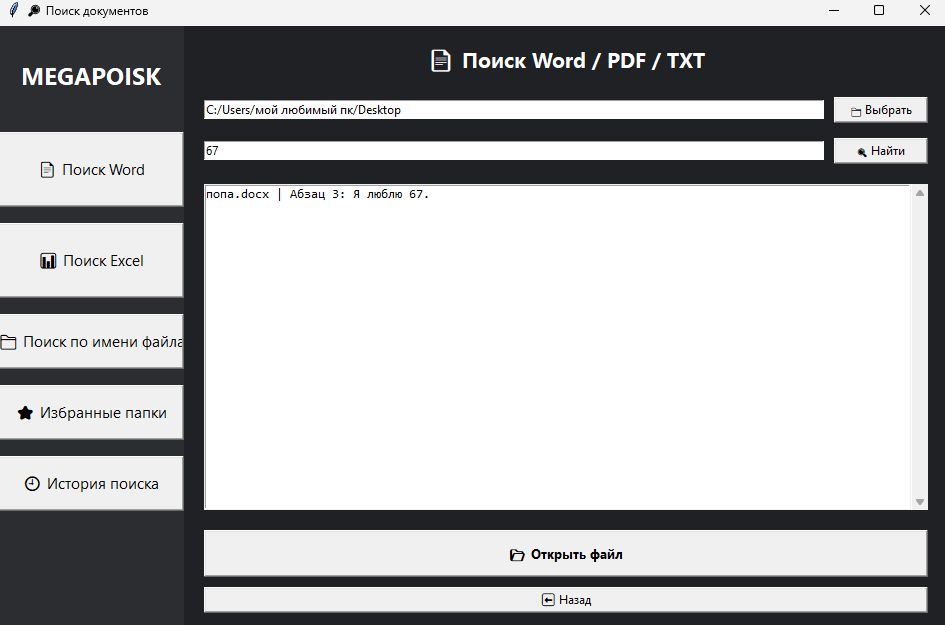
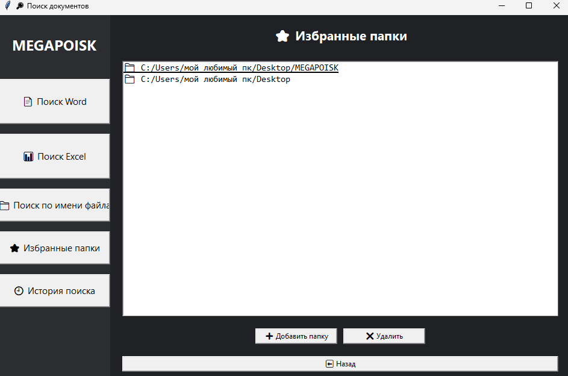

# MEGAPOISK

**MEGAPOISK** — программа для поиска информации внутри файлов **Word, Excel и TXT** по ключевым словам, числам, фразам и другим значениям.

## Возможности

* Поиск по файлам **Word (.docx)**;
* Поиск по файлам **Excel (.xlsx)**;
* Поиск по текстовым файлам **TXT**;
* Поиск по:

  * словам;
  * числам;
  * предложениям;
  * буквам и другим значениям;
* Отображение найденных результатов:

  * имя файла;
  * расположение найденного текста;
  * номер абзаца в Word;
  * строка и столбец в Excel;
* Открытие найденного файла прямо из программы;
* История поиска;
* Избранные папки для быстрого доступа;
* Поиск файлов по имени.

## Как работает поиск

1. Выберите папку, в которой необходимо выполнить поиск.
2. Для ускорения работы рекомендуется выбирать максимально конкретную папку.

Также можно выбрать диск, например `C:\`, но полный поиск по диску может занять больше времени.

3. Введите нужное слово, число или фразу.
4. Нажмите кнопку **«Найти»**.
5. Программа покажет все файлы, в которых найдено совпадение.

## Важно

В версиях **MEGAPOISK v1.1 и ниже** поиск работает только по точному совпадению.

Например:

* если ввести слово с ошибкой — результат может не найтись;
* похожие слова или предложения автоматически не подбираются.

В будущих версиях возможно добавление более гибкого поиска с учётом похожих запросов.

## Установка

Скачайте файл:

```
MEGAPOISK.exe
```

и запустите его.

Для работы программы не требуется устанавливать Python или дополнительные библиотеки.

## Технологии

* Python 3.14
* Использование стандартных и сторонних Python-библиотек для работы с документами и поиска.

## Скриншоты

### Главное окно



### Поиск



### Избранные папки



## Обратная связь

Если у вас есть предложения по улучшению программы или вы нашли ошибку — буду рад получить обратную связь.
